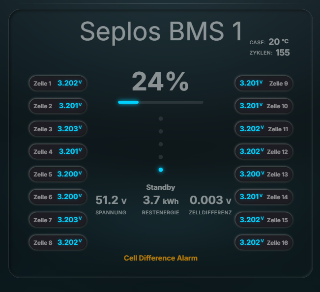

# Glass BMS Card 🔋

[](https://github.com/SirUlbrich/glass-bms-card/releases)
[](LICENSE)
[](https://github.com/SirUlbrich/glass-bms-card/commits/main)
[](https://www.buymeacoffee.com/SirUlbrich)


Eine moderne, elegante Glass-Morphism Karte für Home Assistant zur Visualisierung von Batteriemanagementsystem (BMS) Daten. Das Design setzt auf Transparenz und Unschärfe-Effekte, um sich perfekt in moderne Dashboards einzufügen.

<p align="center">
  
</p>
---

## ✨ Features

- **Glass-Morphism Look:** Hochwertige Optik mit Glas-Effekt durch SVG-Filter.
- **Intelligente Zellanzeige:** Automatische Aufteilung der Zellen (links/rechts), optimiert für bis zu 16 Zellen.
- **SOC Visualisierung:** Große Prozentanzeige mit optionalem Fortschrittsbalken und Ladestands-Punkten.
- **Sicherheits-Monitoring:** Farblich kodierte Warnungen für Zelldifferenzen (Warn/Alarm).
- **Interaktiv:** Direkter Zugriff auf Sensordetails durch Klick auf die Zellen oder Messwerte.
- **Optimierte Typografie:** Erzwingt die "Inter" Schriftart für perfekte Lesbarkeit auf Desktop und Mobilgeräten.

---

## 🛠️Installation
[](https://my.home-assistant.io/redirect/hacs_repository/?owner=SirUlbrich&repository=glass-bms-card&category=plugin)

<details>
<summary> 🔧 Option 2 – Manuelle Installation <b>über HACS</b></summary>
<br>

1. Öffne HACS in deiner Home Assistant Oberfläche.
2. Gehe zu den **Einstellungen** → **Benutzerdefinierte Repositories**.
3. Klicke auf **Repository hinzufügen** und gib die folgende URL ein:

<br>

```
https://github.com/SirUlbrich/glass-bms-card
```

4. Wähle **Lovelace** als Kategorie aus.
5. Klicke auf **Hinzufügen**, um zu bestätigen.
6. Gehe zu **HACS** → **Frontend**, suche nach **Glass BMS Card** und klicke auf **Herunterladen**.
7. Starte Home Assistant neu, um die Einrichtung abzuschließen.

</details>

<br>

<details>
<summary>🔧 Option 3 – Manuelle Installation <b>ohne HACS</b></summary>

<br>

1. Erstelle einen Ordner `glass-bms-card` in deinem `www` Verzeichnis von Home Assistant.
2. Kopiere die Datei `glass-bms-card.js` aus dem `dist` Ordner dorthin.
3. Füge die Ressource in Home Assistant unter **Einstellungen -> Dashboards -> Ressourcen** hinzu:
   - URL: `/local/glass-bms-card.js`
   - Typ: `JavaScript Module`
</details>

---
## 📝 Konfiguration

Hier ist ein Beispiel für die vollständige Konfiguration in deinem Dashboard:

```yaml
type: custom:glass-bms-card
title: "Hauptbatterie"
entities:
  - sensor.bms_cell_1
  - sensor.bms_cell_2
  - ...
soc: sensor.bms_soc
voltage: sensor.bms_total_voltage
remaining: sensor.bms_remaining_energy
celldiff: sensor.bms_cell_difference
cycles: sensor.bms_cycles
case_temp: sensor.bms_temperature
status: sensor.bms_status
failure: sensor.bms_failure_message
soc_bar: true
soc_dots: true
diff_warn: 0.05
diff_alarm: 0.10
diff_alarm_active: true